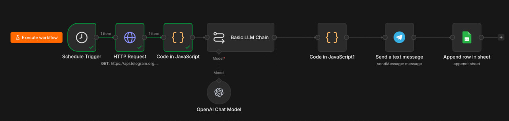
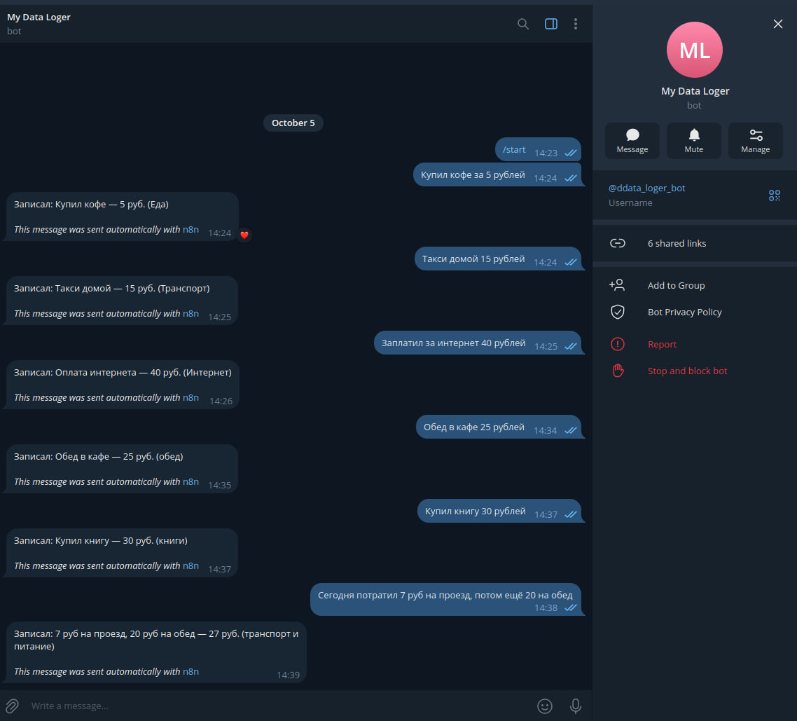
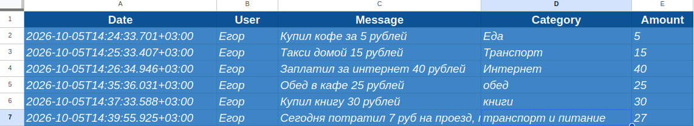

# telegram-ai-logger
Telegram bot + AI + Google Sheets via n8n
# Telegram AI Logger

Бот для учёта расходов: принимает сообщения в Telegram, через AI извлекает категорию и сумму, записывает в Google Sheets и отвечает пользователю.

## 🎯 Задача

Ручной учёт расходов отнимает время. Нужно решение, которое работает прямо в мессенджере — без открытия таблиц и приложений.

## 🛠️ Решение

- **Telegram Bot** (polling, без вебхуков — работает в регионах с блокировками)
- **AI** (OpenAI-совместимый API через Vedai) — извлекает структурированные данные из текста
- **Google Sheets** — хранилище данных
- **n8n** — оркестрация workflow

## 🔧 Стек

- n8n
- Telegram Bot API
- Vedai API (OpenAI-compatible)
- Google Sheets API
- JavaScript

## 📊 Как работает

1. Пользователь пишет боту: `Купил кофе за 5 рублей`
2. n8n забирает сообщение через polling каждую минуту
3. AI извлекает данные: `{category: "напитки", amount: 5, summary: "кофе"}`
4. Запись добавляется в Google Sheets
5. Бот отвечает: `Записал: кофе — 5 руб. (напитки)`

## 📸 Скриншоты

### Workflow в n8n

### Диалог с ботом

### Google Sheets

## 🚀 Результат

- Автоматический учёт расходов без ручного ввода
- Работает 24/7 без публичного IP
- Себестоимость: ~0.004 BYN за запрос

## 📌 Ограничения

- Обрабатывает одно сообщение раз в минуту
- Один пользователь (без мультиаккаунта)
- Для продакшена нужен VPS
